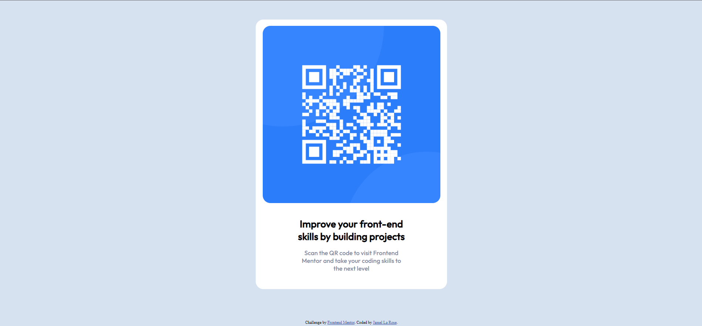

# Frontend Mentor - QR code component solution

This is a solution to the [QR code component challenge on Frontend Mentor](https://www.frontendmentor.io/challenges/qr-code-component-iux_sIO_H). Frontend Mentor challenges help you improve your coding skills by building realistic projects. 

## Table of contents

- [Overview](#overview)
  - [Screenshot](#screenshot)
  - [Links](#links)
- [My process](#my-process)
  - [Built with](#built-with)
  - [What I learned](#what-i-learned)
  - [Continued development](#continued-development)
  - [Useful resources](#useful-resources)

## Overview

### Screenshot



This is a screenshot of my project which I tried to create as close as possible to the original design.

### Links

- Solution URL: [Add solution URL here](https://your-solution-url.com)
- Live Site URL: [Add live site URL here](https://your-live-site-url.com)

## My process

### Built with

- HTML5 markup
- CSS3 custom properties

### What I learned

Learning how to use border-radius to create curved borders for the homepage container and the qr image was a bit challenging something new for me.

```css
.homepage {
   /* background-color: white;
   width: 620px; 
   margin: 100px auto; */

   /* This is the border-radius to create the curved corners of
      the container element */

   border-radius: 25px;
   
   /* padding:auto;
   padding-bottom: 5px;
   text-align:center; */
}

img {
   /* margin: 20px 10px; */

   /* This is the border-radius to create the curved corners of
      the QR image */

   border-radius: 25px;
}
```


### Continued development

I would like to work more on the margin and padding of certain elements contained in the divs I create. 

### Useful resources

- (https://www.w3schools.com/cssref/css3_pr_border-radius.php) - The Border radius property helped me alot with finding out how to create the curved borders.


